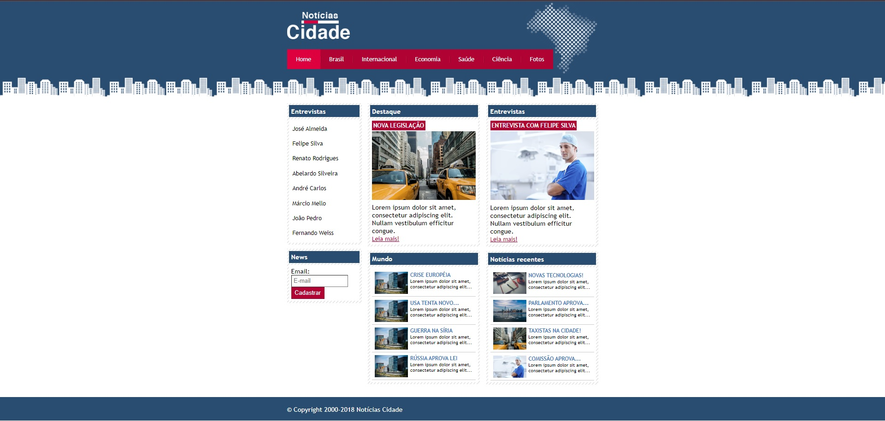

<h1 align="center"> Noticias Cidade </h1>

Seu principal site de noticias fique por dentro de tudo que acontece em tempo real!

 

  

## ✔ Tecnologias

Esse projeto foi desenvolvido com as seguintes tecnologias:

- HTML e CSS
- Git e Github

## 💻 Projeto

O site Noticias Cidade é um site construido para fins didáticos, iniciando com as técnologias HTML e CSS

